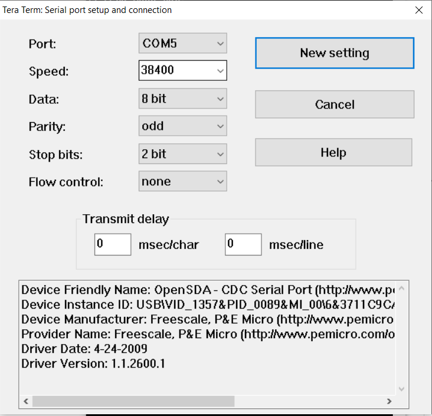
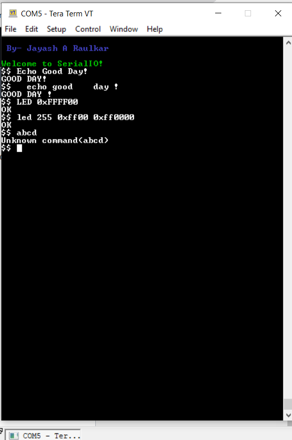

# PES Assignment 6: SerialIO
# README for PES Assignment 6: SerialIO

# Introduction
This project focuses on developing a full command interpreter running over UART0, utilizing interrupts and queues on the FRDM-KL25Z microcontroller. The assignment involves implementing a circular buffer queue, UART communication code, glue code for standard C library functions, and a command processor capable of accepting simple interactive commands.
## Echo Command
The Echo command allows the user to input a string of characters, and the command processor echoes the same string back in uppercase while removing any whitespaces.
## LED Command
The LED command is responsible for controlling the colors of an LED on the device. The user can specify one or more colors in hexadecimal format or as integers (32 bits). If multiple colors are present on the command line, separated by commas or spaces, the LED will flash for 1 second, and the last color specified will stay lit.

# Building the Project
1) Import the provided start code into MCUXpresso.
2) Use the DEBUG build target for development purposes.
3) Set up the necessary terminal parameters: Baud rate 38400, Data size 8, Parity Odd, Stop Bits 2.

# UART Parameters
[in main.c]
#define BAUD_RATE 38400  
[in uart.c]
#define DATA_SIZE 8
#define PARITY    ODD
#define STOP_BITS 2

# Testing
Run the following commands in the interactive terminal to test the command processor:

$$ echo Good Day!
$$ echo good day!
$$ LED 0xFFFF00
$$ led 255 0xFF00 0xFF0000
$$ Invalid Command

## Repository Structure : allfiles
-main.c [file calling various init functions and have my main function runiing the command processor]
-mycmdproc.c [Contains function defination of various functions required for command processor]
-mycmdproc.h [Contains function declaration of various functions required for command processor]
-myuart.c [ contains function for uart initialization, its handler and the glue code that ties UART communication code]
-myuart.h [contains function declarations of uart initialization and __sys_write and __sys_read ]
-mycbfifo.c [ contains function definitions of circular buffer used for UART]
-mycbfifo.h [contains function declarations of LED initialization and led control]
-mysystick.c [This file has functions to initialize the Systick timer and various other API functions]
-mysystick.h [header file for Systick timer]
-mypwm.c [contains the TPM Initialization functions for PTB18 PTB19 and PTD1]
-mypwm.h [contains function declarations of LED initialization and led control]
-sysclock.c [function definations for Clock configration- was provided]
-sysclock.h [function declarations for Clock configration- was provided]
-mtb.c [default file]
-semihost_hardfault.c [default file]