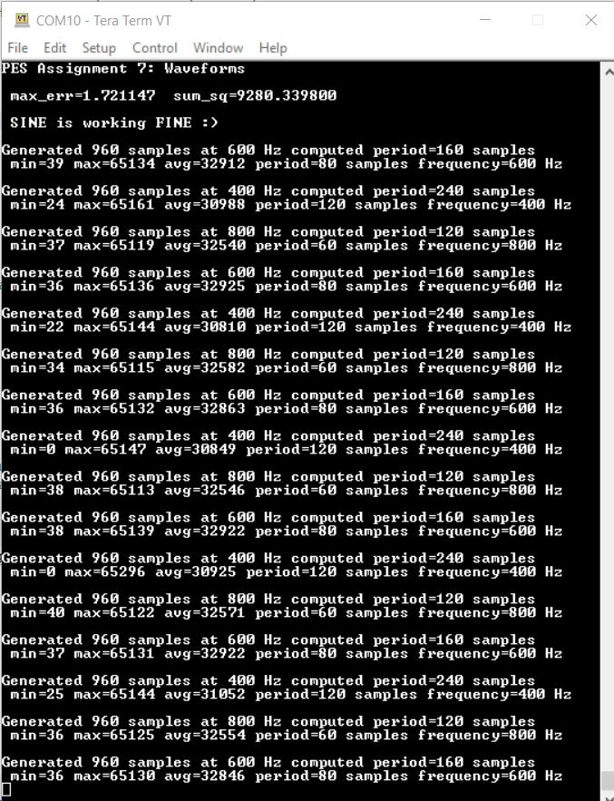

# PES Assignment 7: Waveforms
# Overview
This project focuses on digital-to-analog conversion (DAC) and analog-to-digital conversion (ADC) using the KL25Z microcontroller's direct memory access (DMA) subsystem. The goal is to generate, play, and analyze three waveforms (square, sine, and triangle) through the DAC, then capture and analyze the analog output using the ADC. The implementation involves various modules, including waveform generation, output and input handling, analysis, and an optional extra credit for implementing the sin(x) function using only integer operations.

# Project Structure
 - main.c (This is the main file which calls all initialization function and all waveform functions)
 - fp_trig.h (header file for a fixed-point implementation of trignometric and other functions)
 - fp_trig.c (This file the functions defined for calculating the triangle value and square value for x also it has function to calculates the Sin values using taylor series)
 - test_sine.h (header file of function for testing sin values)
 - test_sine.c (function for testing sin values from fp_trig.o and for my taylor implemetation as well)
 - op_module.h (This is header file of functions for DAC intialisation, for generating the buffer, DMA)
 - op_module.c (This file has functions for DAC intialisation, for generating the buffer, DMA)
 - ip_module.h (Header file ADC initialisation and analyzing Waveforms)
 - ip_module.c (This file has functions for ADC intialisation and analysing Waveforms)
 - autocorrelate.h (header file of autocorrelate function)
 - autocorrelate.c (Detect the period of the fundamental frequency in a buffer full of samples)
 - mytpm.h (header file for TPM init functions)
 - mytpm.c (This file has function defination for TPM initialisation)
 - mysystick.h (header file for Systick timer)
 - mysystick.c (This file has functions to initialize the Systick timer and various other API functions)
 - mtb.c (default ide generated file)
 - semihost_hardfault.c (default ide generated file)

# Screenshots of Waveforms
We can see the frequency value and amplitude in the measurement section of the screenshots. Frequency comes out quite close to what is asked and the pk to pk comes a little less than 3.3V as TRIG_SCALE_FACTOR is 2037 (wiz less than 3v3 value of 2047)

Drive link in case if Screenshot in readme is not visible:
https://drive.google.com/drive/folders/1W9qbN08Baocz8EfaAwhixbP4EG8E67k_?usp=sharing

## SINE waveform (600Hz)

    

    

    

    
## SQUARE waveform (400Hz)

    

    

    
## TRIANGULAR waveform (800Hz)
      

## Terminal
    

NOTE: I have implemented the first part which was the SIN function using taylor series upto 5 terms using only integer math. 
For the secound part I checked the error with test sin fucntion and it came out more than desired value of err and sum sq thus used the given fp_sin for implemtation.